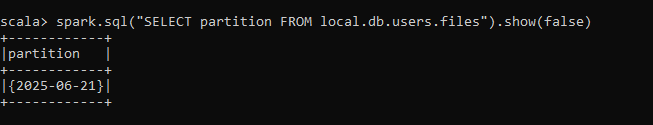

# Iceberg Hidden Partitioning (Scala + Spark)

This project demonstrates how **Apache Iceberg hidden partitioning** works using **Apache Spark 3.4.x** and **Scala**.

---

## What Is Hidden Partitioning?

In Iceberg, you can partition data using **transformed values** (like `days(event_time)`), but the partition column is **not exposed** in the table schema.

You benefit from:
- Partition pruning
- Cleaner schemas
- Efficient query performance

---

## Requirements

- Java 8+
- Apache Spark 3.4.x
- Scala 2.12.x
- Iceberg runtime JAR (Spark 3.4 version):

## How to Run

### Use spark shell (Quick Demo)

Step 1: Launch Spark Shell with Iceberg

```bash
spark-shell \
  --packages org.apache.iceberg:iceberg-spark-runtime-3.4_2.12:1.4.2 \
  --conf spark.sql.catalog.local=org.apache.iceberg.spark.SparkCatalog \
  --conf spark.sql.catalog.local.type=hadoop \
  --conf spark.sql.catalog.local.warehouse=warehouse \
  --conf spark.sql.extensions=org.apache.iceberg.spark.extensions.IcebergSparkSessionExtensions
```
step 2: Run the code 

After the Spark shell launches, do the following:

1. Open the file `hidden_partition.txt`.
2. **Copy** all the Scala code from the file.
3. **Paste** it directly into the `spark-shell` terminal.
4. Press Enter to execute.

The code will:
- Drop the existing table (if any)
- Create a new Iceberg table partitioned by `days(event_time)`
- Insert sample data
- Query the data
- Show the internal hidden partition structure


## View Hidden Partitions in Iceberg Metadata

``` bash
spark.sql("SELECT partition FROM local.db.users.files").show(false)
```
### Sample Output 



This confirms that Iceberg partitioned the data using days(event_time) — the value 2025-06-21 is the hidden transformed partition, not part of the user-visible schema.

## Check Partition Pruning with Explain

.explain(true) to confirm that Spark and Iceberg are working together to prune partitions during queries

```bash
spark.sql("""
  SELECT * FROM local.db.users
  WHERE event_time >= TIMESTAMP '2025-06-21 00:00:00'
""").explain(true)
```

In Physical plan we can see 

```bash
[filters=event_time IS NOT NULL, event_time >= ...]
```
This means Spark pushed the filter down to the Iceberg scan, and Iceberg will only read the matching partition(s), thanks to hidden partitioning
